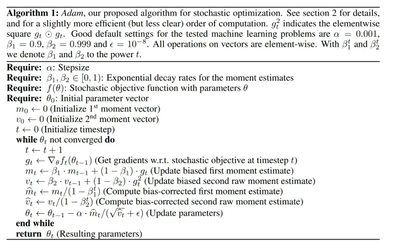

# Project1第一部分实验报告
22307130158 吴优
## 实验内容
反向传播算法
对于反向传播算法的理解通过计算网络预测输出与实际目标之间的误差，并将误差反向传播到网络中的每一层，以调整网络中的权重和偏差，从而最小化误差。这个过程可以分为两个主要步骤：
前向传播：在前向传播过程中，输入数据通过网络，经过线性计算和激活函数后，得到网络的预测输出。
反向传播：在反向传播过程中，首先计算预测输出与实际目标之间的误差。然后，这个误差被反向传播回网络，通过链式法则计算每一层的误差贡献。在每一层，根据误差的贡献，调整该层的权重和偏差，以减小整体误差。使用梯度下降法，以调整各个weight以及bias的大小

### 任务1 拟合函数`y=sin(x)`
#### 整体架构
1. **初始化函数 (`__init__`)：** 在初始化函数中，指定了神经网络的层大小 `layer_sizes`，然后调用 `initialize_parameters` 方法初始化参数，并创建一个空列表 `costs` 用于存储训练过程中的损失值。
2. **初始化参数 (`initialize_parameters`)：** 这个方法根据指定的层大小初始化权重和偏置参数，使用了随机初始化权重和零初始化偏置。
3. **ReLU 激活函数和导数：** 实现 ReLU 激活函数和其导数，用于神经网络的前向传播和反向传播过程中。
4. **前向传播 (`forward_propagation`)：** 通过循环遍历每一层，计算每一层的加权输入和激活值，并将中间结果缓存起来以备反向传播使用。最后一层的输出没有经过激活函数，直接作为输出。
5. **损失计算 (`compute_cost`)：** 计算预测值与真实值之间的均方误差损失。
6. **反向传播 (`backward_propagation`)：** 从输出层开始，通过反向遍历缓存的中间结果，计算梯度并更新参数。
7. **参数更新 (`update_parameters`)：** 根据梯度下降的规则，更新神经网络的参数。
8. **模型训练 (`train`)：** 在训练过程中，通过前向传播计算预测值，然后通过反向传播计算梯度并更新参数，同时记录损失值。
9. **模型预测 (`predict`)：** 使用训练好的神经网络进行预测。
#### 代码分析
重点对于前向传播和反向传播代码部分进行分析
```python
    def forward_propagation(self, X):
        caches = []
        A = X
        L = len(self.parameters) // 2

        for l in range(1, L):
            A_prev = A
            W = self.parameters['W' + str(l)]
            b = self.parameters['b' + str(l)]
            Z = W.dot(A_prev) + b
            A = self.relu(Z)
            caches.append((A_prev, Z))

        W = self.parameters['W' + str(L)]
        b = self.parameters['b' + str(L)]
        Z = W.dot(A) + b
        A = Z
        caches.append((A, Z))

        return A, caches
```
代码分析：以上是前向传播过程的相关函数，首先将输入层x赋给激活数组A，然后与权重矩阵W相乘再加上偏置矩阵b得到加权输入Z，经过relu函数激活后得到下一轮的激活值A,将激活值A与下一层的加权输入Z作为一个map存储到caches中，保存中间结果便于反向传播的计算，重复以上过程。对于最后一层，不需要使用relu激活函数，将相等的激活值A与加权输入Z存储到caches中。
```python
    def backward_propagation(self, A, Y, caches):
        grads = {}
        L = len(caches)
        m = A.shape[1]
        Y = Y.reshape(A.shape)

        dA_prev = (A - Y)

        for l in reversed(range(L)):
            A_prev, Z = caches[l]
            dZ = dA_prev * (l == L-1 or self.relu_derivative(Z))
            dW = dZ.dot(A_prev.T) / m
            db = np.sum(dZ, axis=1, keepdims=True) / m
            dA_prev = self.parameters['W' + str(l+1)].T.dot(dZ)

            grads['dW' + str(l+1)] = dW
            grads['db' + str(l+1)] = db

        return grads

    def update_parameters(self, grads, learning_rate):
        L = len(self.parameters) // 2
        for l in range(1, L+1):
            self.parameters['W' + str(l)] -= learning_rate * grads['dW' + str(l)]
            self.parameters['b' + str(l)] -= learning_rate * grads['db' + str(l)]
```
代码分析：反向迭代，从BP网的输出层向前，用激活值的梯度使用relu的导数求得加权输入的梯度，与激活值点积求出权重矩阵的梯度dW，偏置的梯度通过对所有样本的激活值的梯度求平均得到，为了下一层的遍历将激活值的梯度向前传递，即与偏置矩阵相乘。
update_parameters函数用于更新所有的偏置矩阵与权重矩阵，采用梯度下降法，向着减小loss值的方向进行迭代。
#### 具体对于sin（x）的拟合
采取两个隐藏层的设计，具体为[1,32,64,1],学习率选用0.01,实验发现迭代次数10000次左右时，loss值即可减小到0.0005左右，当迭代次数设置为100000次时，拟合出的图线几乎与实际图线完全重合
相关代码：
```python
# 数据生成
x = np.random.uniform(-np.pi, np.pi, 400).reshape(1, -1)
y = np.sin(x)
x_test=np.linspace(-np.pi,np.pi,400).reshape(1,-1)
y_test=np.sin(x_test)

# 模型参数
layer_sizes = [1, 32, 64, 1]
learning_rate = 0.01
num_iterations = 100000

# 创建并训练模型
model = NeuralNetwork(layer_sizes)
model.train(x, y, learning_rate, num_iterations)

# 预测
final_predictions = model.predict(x_test)

# 可视化
plt.figure(figsize=(10, 5))
plt.plot(x_test.flatten(), y_test.flatten(), label='True sin(x)')
plt.plot(x_test.flatten(), final_predictions.flatten(), label='NN Prediction')
plt.title("Neural Network Approximation of sin(x)")
plt.legend()
plt.show()
```

### 任务2 为12个手写汉字进行分类
在任务1实现的BP网的基础上，实现了对12个手写汉字的分类
#### 总体架构
1. **NeuralNetwork 类**：
   - `__init__` 用于初始化神经网络的参数，包括输入大小、隐藏层数、每个隐藏层的神经元数量、输出大小和 dropout 率。
   - `forward` 实现了前向传播，计算每一层的输出，并应用 ReLU 激活函数和 softmax 函数处理输出层。
   - `backward` 实现了反向传播，用于更新网络参数。使用 Adam 优化算法来更新权重和偏置。
   - `cross_entropy_loss` 计算交叉熵损失。
   - `load_and_preprocess_image` 加载和预处理图像数据。
   - `apply_dropout` 在训练过程中应用 dropout 操作。
   - `plot_accuracy` 用于绘制准确率曲线图。

2. **relu_derivative 函数**：
   - ReLU 激活函数的导数。

3. **evaluate_model 函数**：
   - 用于评估模型在测试数据上的准确率。

4. **数据加载和预处理**：
   - 从给定的主目录加载图像数据，并将其转换为灰度图像，并将图像数据进行归一化处理。


5. **训练和评估**：
   - `train` 方法用于训练神经网络，使用给定的训练数据和超参数。
   - `predict` 方法用于使用训练好的神经网络进行预测。
   - 使用给定的训练数据和测试数据进行模型训练和评估。
#### 代码分析
1. 图片数据处理
```python
train_inputs = []
train_labels = []
test_inputs = []
test_labels = []
main_dir = "train_data/train"  # 这里应该是数据存放的主目录路径
# 遍历主目录下的子目录
for subdir_name in sorted(os.listdir(main_dir)):
    subdir_path = os.path.join(main_dir, subdir_name)
    if not os.path.isdir(subdir_path):
        continue  # 如果不是子目录，则跳过

    # 为每个子目录分配一个唯一的独热编码
    label = int(subdir_name) - 1  # 子目录名称从1开始，独热编码从0开始
    one_hot_label = np.eye(12)[label]

    # 遍历子目录中的图像文件
    image_files = os.listdir(subdir_path)
    np.random.shuffle(image_files)  # 洗牌功能

    for i, filename in enumerate(image_files):
        # 读取图像
        image_path = os.path.join(subdir_path, filename)
        img = Image.open(image_path)
        # 将图像转换为灰度图像
        gray_img = img.convert('L')
        # 将灰度图像转换为NumPy数组
        img_array = np.array(gray_img)
        # 将图像数据添加到训练或测试数据中
        normalized_img = img_array / 255.0
        if i < len(image_files) * 0.8:  # 80%的数据用于训练
            train_inputs.append(normalized_img.reshape(1, -1))
            train_labels.append(one_hot_label)
        else:  # 其余20%的数据用于测试
            test_inputs.append(normalized_img.reshape(1, -1))
            test_labels.append(one_hot_label)

# 将列表转换为NumPy数组
X_train = np.vstack(train_inputs)
y_train = np.vstack(train_labels)
X_test = np.vstack(test_inputs)
y_test = np.vstack(test_labels)
```
解析：用main_dir存储主目录路径，然后遍历主目录下的各个子目录，为每个子目录分配一个独热编码，然后遍历主目录下的图像文件，并调用np中的洗牌功能，然后读取图像信息，将图像转化为灰度图像再转化成NumPy数组，并随机选取80%的数据进行训练，另外20%作为测试集。


2. 前向传播
```python
    def forward(self, x,training=True):
        activations = []
        layer_output = x

        # 前向传播计算每一层的输出
        for i in range(len(self.weights)):
            layer_output = np.dot(layer_output, self.weights[i]) + self.biases[i]
            if i < len(self.weights) - 1:
                layer_output = self.relu(layer_output)  # 使用 ReLU 激活函数
                if training:
                    layer_output = self.apply_dropout(layer_output)  # 应用 dropout 操作
            activations.append(layer_output)

        # 使用softmax处理最后的输出
        exp_vals = np.exp(layer_output - np.max(layer_output, axis=1, keepdims=True))
        activations[-1] = exp_vals / np.sum(exp_vals, axis=1, keepdims=True)

        return activations
```
解析：参数为输入层的输入向量与是否为训练模式的标志，通过循环遍历每一层的权重和偏置，计算每一层的输出。在每层计算完毕后，使用 ReLU 激活函数对输出进行非线性变换，并在训练模式下应用 dropout 操作以防止过拟合。最后，对输出层的结果应用 softmax 函数，将输出转换为概率分布。
*（关于dropout的详细解释在bonus部分解析）*


3. 反向传播
```python
    def backward(self, x,activations, y_true, learning_rate):
        self.t += 1  # Increment time step for Adam
        y_pred = activations[-1]
        delta = y_pred - y_true
        d_weights = []
        d_biases = []

        # Calculate gradients for output layer
        d_weights.append(activations[-2].T.dot(delta))
        d_biases.append(np.sum(delta, axis=0, keepdims=True))
        
        # Propagate the error backwards
        for i in range(len(self.weights)-1 , 0, -1):
            delta = delta.dot(self.weights[i].T) * np.where(activations[i-1] > 0, 1, 0)
            if i == 1:
                d_weight = x.T.dot(delta)


            else:
                d_weight = activations[i - 2].T.dot(delta)

            d_bias = np.sum(delta, axis=0, keepdims=True)
            d_weights.append(d_weight)
            d_biases.append(d_bias)

        d_weights.reverse()
        d_biases.reverse()
        # Update weights and biases using Adam
        for i in range(len(self.weights)):
            self.m_weights[i] = self.beta1 * self.m_weights[i] + (1 - self.beta1) * d_weights[i]  # Fix here
            self.v_weights[i] = self.beta2 * self.v_weights[i] + (1 - self.beta2) * (d_weights[i] ** 2)  # Fix here
            m_hat = self.m_weights[i] / (1 - self.beta1 ** self.t)
            v_hat = self.v_weights[i] / (1 - self.beta2 ** self.t)
            self.weights[i] -= learning_rate * m_hat / (np.sqrt(v_hat) + self.epsilon)

            self.m_biases[i] = self.beta1 * self.m_biases[i] + (1 - self.beta1) * d_biases[i]  # Fix here
            self.v_biases[i] = self.beta2 * self.v_biases[i] + (1 - self.beta2) * (d_biases[i] ** 2)  # Fix here
            m_hat_bias = self.m_biases[i] / (1 - self.beta1 ** self.t)
            v_hat_bias = self.v_biases[i] / (1 - self.beta2 ** self.t)

            self.biases[i] -= (learning_rate * m_hat_bias / (np.sqrt(v_hat_bias) + self.epsilon)).reshape(self.biases[i].shape)

```
代码解析：传入参数有输入层x值，每一层的激活值，真实的输出值以及学习率，首先，计算输出层的梯度，然后通过循环遍历每一层，将误差从输出层传播回输入层，计算每一层的权重和偏置的梯度。接着，利用Adam优化算法更新权重和偏置。
*（关于adam算法详细在Bonus中详细解析）*
3. 模型效果检测部分
- 交叉熵的计算
```python
    def cross_entropy_loss(self, y_true, y_pred):
        m = y_true.shape[0]
        epsilon = 1e-9  # 小常数，防止计算对数0
        y_pred = np.clip(y_pred, epsilon, 1 - epsilon)  # 将预测值限制在[epsilon, 1-epsilon]区间内
        log_likelihood = -np.log(y_pred[range(m), y_true.argmax(axis=1)])
        loss = np.sum(log_likelihood) / m
        return loss
```
计算传递后对应值的对数似然值求和在对样本数量求平均数，得到交叉熵的平均值

- 测试集准确度检验
```python
def evaluate_model(network, X_test, Y_test):
    predictions = network.forward(X_test,False)
    predicted_classes = np.argmax(predictions[-1], axis=1)
    true_classes = np.argmax(Y_test, axis=1)
    accuracy = np.mean(predicted_classes == true_classes)
    return accuracy
```
对X_test进行前向传播，并与Y_test进行比较，求出正确的概率
#### 不同架构不同参数的比较
由于如果只看loss的大小无法判断欠拟合与过拟合，所以我选择每100个epoch在测试集上测试一次并计算出准确率，使用测试集上的准确率来判断模型的学习能力。
*neurons_per_layer为隐藏层的个数以及每一层的神经元数目，learning_rate为学习率，dropout_rate为随机丢弃隐藏层神经元的部分*
- neurons_per_layer = [64],learning_rate=0.0002,dropout_rate=0.2，在2000个epoch后准确率基本稳定在0.855。
- neurons_per_layer = [128],learning_rate=0.0002,dropout_rate=0.2，在4000个epoch后准确率基本稳定在0.875。
- neurons_per_layer = [128],learning_rate=0.0002,dropout_rate=0.5，在5000个epoch后准确率基本稳定在0.885。
- neurons_per_layer = [128，64],learning_rate=0.0002,dropout_rate=0.2，在5500个epoch后准确率基本稳定在0.88。
- neurons_per_layer = [128，64，32],learning_rate=0.0002,dropout_rate=0.2，在6000个epoch后准确率基本稳定在0.84
- neurons_per_layer = [256],learning_rate=0.00005,dropout_rate=0.2，在4700个epoch后准确率基本稳定在0.88。
- neurons_per_layer = [128，64],learning_rate=0.00005,dropout_rate=0.5，在5000个epoch后准确率基本稳定在0.88，9000次时基本稳定在0.89
#### 对于反向传播算法的理解
在正向传播过程中，输入信息通过逐层处理并传向输出层。如果在输出层得不到期望的输出值，则通过构造输出值与真实值的损失函数作为目标函数，转入反向传播，逐层求出目标函数对各神经元权值的偏导数，构成目标函数对权值向量的梯度，作为修改权值的依据，网络的学习在权值修改过程中完成。输出值与真实值的误差达到所期望值时，网络学习结束。
#### 对于误差函数的选择
在拟合正弦函数时，我们选择均方误差作为损失函数。在处理对12个手写汉字的分类时，选择交叉熵损失作为损失函数，因为在求w的梯度时，如果使用均方差作为损失函数产生的结果包含sigmoid函数的导数，而sigmoid函数的结果在0和1附近时梯度非常小，学习速度很慢，而对于分类问题，最后的结果大多数都是落在0和1附近。如果选择交叉熵函数作为损失函数，对于w的梯度非常简洁，主体项就是实际值与真实值的差。
所以分类问题多用交叉熵作为损失函数而不是使用均方误差。
### 应用adam算法提高准确率
为提高任务二的准确率，选择应用了Adam算法
对于adam算法理解
只需要一阶梯度，使用一阶矩和二阶矩来计算不同参数的个体自适应学习率。

对于以上参数的理解
t：步数
 $\alpha$ ：学习率
$\theta$：参数
f（$\theta$）：目标函数
g（t）：上导
$\beta$<sub>1</sub>：一阶矩衰减系数0.9，t次方后递减
$\beta$<sub>2</sub>：二阶矩衰减系数0.999
m<sub>t</sub>：均值（一阶矩）（求过往所有梯度和现梯度的均值）即动量
v<sub>t</sub>：梯度平方和现梯度平方的均值
$\hat{m}$<sub>t</sub>：m<sub>t</sub>偏置校正（校正值，使得学习的步长越来越小）
$\hat{v}$<sub>t</sub>：v<sub>t</sub>偏置校正
### 使用dropout方法防止过拟合
```python
    def apply_dropout(self, x):
        # 在训练过程中应用 dropout 操作
        mask = np.random.rand(*x.shape) < self.dropout_rate
        x *= mask
        x /= self.dropout_rate
        return x
```
从隐藏层神经元中随机选择一个一半大小的子集临时删除掉。对一小批训练样本，先前向传播然后反向传播损失并梯度下降法更新参数。不断重复这一过程这样可以使得神经网络泛化性更强，防止过于依赖于局部的特征。
